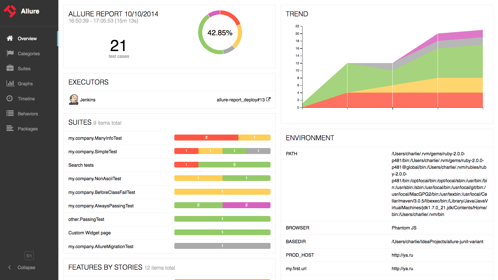

# AUTOMATION PROJECT 

Contents
========

 * [Installation](#)
 * [Run Test](#)
 * [Configuration](#)
 * [Logs](#)
 * [Configuration](#)
 * [Reporters](#)
 * [Page Object Design Pattern](#)
 * [Project File Structure](#)
 * [Naming Conventions](#)


---
## Getting Started

This repository contains a collection of the WebdriverIO project and libraries and instructions that demonstrate how to use the tool and develop automation script using the Mocha BDD framework. It uses the chromedriver NPM package that wraps the ChromeDriver for you. 

It support ES6 (via babel-register) and provides common utilities to support testing. It generate Spec, `JUNIT`, `Allure` reporters as well.

This project is tested on `Node v12.0.0`.

`Node.JS:` Install  from the site - https://nodejs.org/en/  take the LTS version based on your Operating system. Please make sure you install NodeJS globally. To take full advantage of the command line and use grunt tasks you will need to make sure that you have added `node_modules/.bin` to your `$PATH`.


`JDK 1.8:` It is optional, install JDK 1.8+ and make sure class path is set properly. JAVA is require to start  `Selenium Server` on your local environment nothing else.

---
### Installation


---
### Run Tests
You can start your test suite by using the `run` command and pointing to a WebdriverIO config file

```
npx wdio run ./test/config/wdio.local.conf.js
```

If you like to run specific test files you can add a --spec parameter:
```
npx wdio run ./test/config/wdio.local.conf.js --spec login-spec.js
```
or define suites in your config file and run just the test files defined by in a suite:
```
npx wdio run ./test/config/wdio.local.conf.js --suite exampleSuiteName
```


---
## Config Files

WebdriverIO uses configuration files to setup and execute tests in specific ways.  The configuration is fully customizable, and different functions can be invoked before, during and after each test or test suite.  Config files are found in the `/test/config/` directory and all end with `*.conf.js`.  These can be called via the the cli

---
## Logs  
Complete set of execution logs will be generated during the run time and can be found in the parent folder location `/logs`.

---
## Reporters
WebdriverIO uses several different types of test reporters to communicate pass/failure.


### `Allure`

The Allure Reporter creates [Allure](http://allure.qatools.ru/) test reports which is an HTML generated website with all necessary information to debug your test results and take a look on error screenshots. Add allure to the reporters array in config file and define the output directory of the allure reports.  Please note, this has been added in .config.

To generate and view an allure report locally, run

```
 npm run allure-report
 ```
 A typical Allure report will look like this




Allure has several other reporting tools optimized for the CI server of your choice.  You can [view the documentation here](https://docs.qameta.io/allure/#_reporting).


---
## Page Object Design Pattern


Within your web app's UI there are areas that your tests interact with. A Page Object simply models these as objects within the test code. This reduces the amount of duplicated code and means that if the UI changes, the fix need only be applied in one place. In other wards one of the challenges of writing test automation is keeping your [selectors] (classes, id's, or xpath's etc.) up to date with the latest version of your code.  The next challenge is to keep the code you write nice and [DRY] (Don't Repeat Yourself).  The page object pattern helps us accomplish this in one solution.  Instead of including our selectors in Spec file (in Mocha), we instead place them in a `<pagename-page>.js` file where we can manage all these selectors and methods together. Your test file should only call the test methods.

You can also place reusable functions or logic inside of these pages and call them from your step files. The page object serves as a layer of abstraction between tests and code.  When A test fails, it fails on a individual step.  That step may call a selector that is no longer valid, but that selector may be used by many other steps.  By having a single source of truth of what the selector is supposed to be, fixing one selector on the page object could repair a number of failing tests that were affected by the same selector.

An object called `Page` will be created with the prototype model or by ES6 class pattern.  This ensures that every instance of a page object is exported as a stateless construct. Any any changes to that state are handled in the browser, rather than on the server.

```javascript
//page.js
module.exports = class Page {
  
    async open (path) {
        await browser.url(path)
    }
}
```

It is preferable to separate page objects into individual files that end with `.page.js`.  These will require the basic `page.js` prototype construct / abstract class and create new objects for each individual page.

For more information on the implementation of `Page Object Design Pattern`, refer to the `/test/page` directory. 


A typical page class using ES6 syntax will look similar to this:

```javascript
//login-page.js
const Page = require('./page');

class LoginPage extends Page {

    get username () { return $('#Email') }
    get password () { return $('#Password') }
    get LoginBtn () { return $('.login-button') }
    get flash () { return $('div.message-error span') }
    get headerLinks () { return $$('#header a') }
    get customerInfo () { return $('div.header-links ul li:nth-child(1) a') }

    async open () {
        await super.open('login')
    }

    async login () {
        await this.LoginBtn.click()
    }

}

module.exports = new LoginPage();
```
Unit Test example
```javascript

//login-spec.js
const LoginPage = require('../page/login-page');
const LoginPageData = require('./data/login-page');

describe('TEST LOGIN PAGE', () => {
    it('should deny access with wrong creds', async () => {
        await LoginPage.open()
        await LoginPage.username.setValue('foo@test.com')
        await LoginPage.password.setValue('bar')
        await LoginPage.login()
        await expect(LoginPage.flash).toHaveTextContaining("Login was unsuccessful");
    })

    it('should allow access with correct creds', async () => {
        await LoginPage.open()
        await LoginPage.username.setValue(LoginPageData.username)
        await LoginPage.password.setValue(LoginPageData.password)
        await LoginPage.login()
        await expect(LoginPage.customerInfo).toHaveText(LoginPageData.username);
    })
})
```

## Project File Structure
---

```shell
WebdriverIO
├── test/
│   ├── config/
│   │   └── wdio.conf.js
│   ├── page/
│   │   └── login-page.js
│   │   └── page.js
│   └── spec/
│   |   └── data/
│   |   |     └── login-page.js
│   |   └── log-spec.js
│   └── util/
│       └── common-utilities.js
│       └── readfile-utilities.js
│       └── database-utilities.js
├── .gitignore
│ 
└── package.json

```

## Project Naming Conventions
---
There are four strategies of naming files in JavaScript: `PascalCase`, `camelCase`, `UPPERCASE`, and `kebab-case`.

---
### `FILE NAMES`
We will use `kebe-case`
```
│   ├── page/
│   │   └── login-page.js
│   │   └── page.js
│   └── spec/
│   |   └── data/
│   |   |     └── login-page.js
│   |   └── log-spec.js
│   └── util/
│       └── common-utilities.js
```
---
### `FUNCTION NAMES`

JavaScript functions will be written in `camelCase`. In addition, it's a best practice to actually tell what the function is doing by giving the function name a verb as prefix. This verb as prefix can be anything (e.g. get, fetch, push, apply, calculate, compute, post).

```javascript
// bad
function name(firstName, lastName) {
  return `${firstName} ${lastName}`;
}
 
// good
function getName(firstName, lastName) {
  return `${firstName} ${lastName}`;
}
```
### Handle Boolean Function
A prefix like `is`, `are`, or `has` helps every JavaScript developer to distinguish a boolean from another variable by just looking at it:
```javascript
// bad
var visible = true;
 
// good
var isVisible = true;
 
// bad
var equal = false;
 
// good
var areEqual = false;
 
// bad
var encryption = true;
 
// good
var hasEncryption = true;
```
---
### `CLASS NAMES`
We will use `PascalCase `
```javascript
class SoftwareDeveloper {
  constructor(firstName, lastName) {
    this.firstName = firstName;
    this.lastName = lastName;
  }
}
 
var me = new SoftwareDeveloper('Robin', 'Wieruch');
```
---
### `METHODS NAMES`
Identical to JavaScript functions, a method on a JavaScript class is declared with `camelCase`. It's a best practice to actually tell what the method is doing by giving the function name a verb as prefix.

```javascript
class SoftwareDeveloper {
  constructor(firstName, lastName) {
    this.firstName = firstName;
    this.lastName = lastName;
  }
 
  getName() {
    return `${this.firstName} ${this.lastName}`;
  }
}
 
var me = new SoftwareDeveloper('Robin', 'Wieruch');
 
console.log(me.getName());
// "Robin Wieruch"
```
---
### `VARIABLES`
---
#### `CONSTANT`
 Constants intended to be non-changing variables will be written in capital letters `UPPERCASE`
 ```javascript
var SECONDS = 60;
var MINUTES = 60;
var HOURS = 24;
 
var DAY = SECONDS * MINUTES * HOURS;
```
If a variable has more than one word in its variable declaration name, makes use of an underscore (_):
 ```javascript
var DAYS_UNTIL_TOMORROW = 1;
```
---
#### `GLOBAL`
* A global JavaScript variable is declared at the top of a project/file.
* A global JavaScript variable is written in `camelCase` if it is mutable.
*A global JavaScript variable is written in `UPPERCASE` if it is immutable.

---
#### `LOCAL VARIABLES NAMES`
Adding a **`prefix`** makes local varibles data type more self-descriptive.
```javascript
var strFullName = "John Doe"; // String
var numMinutes = 60; // int or float
var boolHasFlag = true; // boolean
var listScorePoints = [1,2,3] // list or array
```

---
